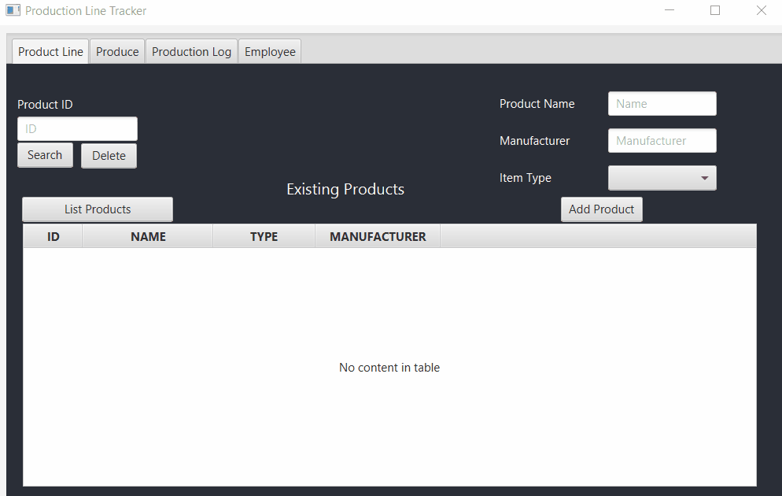

# Project Title
ProductionLineTracker is a Java GUI program assignment created by Ricardo Montoya at Florida Gulf Coast University throughout the COP 3003 
Object-Oriented Programming course. The project incorportates computer programming concepts and problem solving using an object-oriented 
programming language. Topics include use of predefined classes, creation of objects and classes, encapsulation using visibility modifiers, 
inheritance, class hierarchies, polymorphism, interfaces, exceptions, stream I/O, Graphics, and graphical user interfaces (GUIs).

## Demonstration

## Documentation
[JavaDoc](http://localhost:63342/ProductionLineTracker/doc/index.html?_ijt=lutk0ckbc9qavev34c4va8kd24)
## Diagrams

## Getting Started

## Built With

## Contributing

## Author

## License

## Acknowledgments

## History

## Key Programming Concepts Utilized

